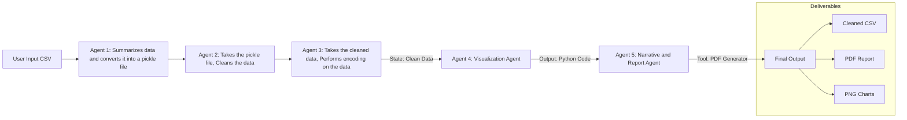

# The Automated Enterprise EDA Analyst
### *Turning Raw Data into Boardroom Insights in Minutes*

---

## 📌 1. The Problem
**Exploratory Data Analysis (EDA)** is the foundation of Data Science, but it is often a bottleneck.
*   **It's Repetitive:** Data Scientists spend hours writing the same boilerplate code to clean nulls, check distributions, and plot histograms.
*   **It's Time-Consuming:** Generating a clean, encoded dataset for Machine Learning takes significant manual effort.
*   **It's Disconnected:** Analysis is often stuck in Jupyter Notebooks, making it hard to share insights with non-technical stakeholders.

## 💡 2. The Solution
Automated EDA Agent is an autonomous, multi-agent system designed for the **Enterprise**. It takes a raw CSV file (any dataset) as input and performs an end-to-end analysis pipeline without human intervention.

Unlike standard chatbots, Sherlock uses a **Sequential Multi-Agent Architecture** where specialized AI agents pass data, code, and files to one another to produce tangible deliverables: **Cleaned Data (CSV)** and an **Executive Report (PDF)**.

## 🏗️ 3. System Architecture
The system utilizes **Google Gemini 2.5 Flash Lite** via the Google Agent Development Kit (ADK). It features **5 Specialized Agents** working in a sequential chain, supported by a Robust Rescue Mechanism to handle API failures.

### **The Agent Team:**
1.  **🕵️ Agent 1: Summarizes Data**
    *   **Role:** Summarizes the raw data.
    *   **Action:** Loads the raw CSV, analyzes schema/types, detects missing values, and creates a lightweight pickle file for downstream agents.
2.  **🧹 Agent 2: Cleans Data**
    *   **Role:** Cleans the data
    *   **Action:** Writes Python code to impute missing values (Mean/Mode) and remove duplicates. Saves `cleaned_data.pkl`.
3.  **🔢 Agent 3: Feature Encoding**
    *   **Role:** Encodes the categorical data.
    *   **Action:** Detects categorical columns and applies One-Hot or Label Encoding. Generates the final `final_data.csv` for user download.
4.  **🎨 Agent 4: Writes code for visualizing the data**
    *   **Role:** Performs Visualizations.
    *   **Action:** Analyzes the dataset schema and writes Python code (Matplotlib/Seaborn) to generate Correlation Heatmaps and Distribution Plots. *Note: This agent generates code but does not execute it.*
5.  **📝 Agent 5: The Analyst (Execution & Reporting)**
    *   **Role:** Report and Narrative.
    *   **Action:** Executes the visualization code, saves images to disk, interprets the findings, and compiles a professional **PDF Report** using a custom tool.

### **Architecture Diagram:**


## 🛠️ 4. Key Features & Technical Highlights

*   **Auto-Correction ("Self-Healing" AI):**
    If Agent 4 writes visualization code that causes an error (e.g., wrong column name), Agent 5 detects the error log, rewrites the code, and tries again automatically.
*   **State Management:**
    The pipeline uses intermediate storage (Pickle files) to pass complex DataFrames between agents, overcoming LLM context window limits.
*   **Robust Fallback Mechanisms:**
    The system includes "Rescue Functions." If an agent "hallucinates" completing a task but forgets to save the file, the main orchestrator detects the missing file and triggers a Python-based fallback to ensure the user *always* gets their CSV and PDF.
*   **Enterprise Outputs:**
    Delivers files that business users actually need (.pdf) and data engineers need (.csv), not just chat text.

## 🚀 5. Setup & Usage Instructions

### **Prerequisites**
*   **Environment:** Kaggle Notebook.
*   **API Key:** Requires a Google Gemini API Key stored in Kaggle Secrets as `GOOGLE_API_KEY`.
*   **Libraries:** Requires `google-generativeai` and `xhtml2pdf`.

### **How to Run**
1.  **Add Data:** Add any CSV dataset to the Kaggle Input directory (e.g., Titanic, House Prices).
2.  **Configure Path:** Update the `CSV_FILE_PATH` variable in the final cell.
3.  **Run All:** Execute the notebook. The agents will perform the analysis in real-time.

```python
# Example Execution
CSV_FILE_PATH = '/kaggle/input/house-price-prediction-data-set/train.csv'
await analyze_new_dataset(CSV_FILE_PATH)
```

## 📊 6. Example Output
Upon completion, the system provides clickable links:

*   **📂 Processed Data:** `final_data.csv` (Ready for Auto-ML or sklearn).
*   **📄 Executive Report:** `Final_Report.pdf` (Includes Summary, Insights, and embedded Visualizations).

---
*Submitted to the Kaggle AI Agents 2025 Competition - Enterprise Track.*
